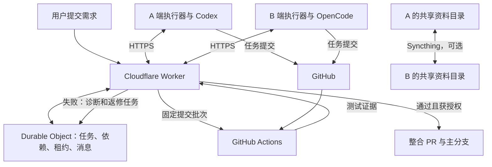

# 双人 Agent 自动并行开发项目书：从零搭建

日期：2026-09-20。版本：1.0。适用环境：两台 Windows 电脑，A 使用 Codex，B 使用 OpenCode。

本文是新项目的建设方案与实施任务书。所有目录、接口、命令约定与参数均为拟定设计；文档交付不表示系统已开发或部署。文中账号、路径变量及提交号均使用占位符。

## 1. 项目目标

建设一个双人自动开发系统：用户提交需求后，系统自动规划任务、确定接口契约、分配给两台电脑上的 agent、收集提交、测试组合结果，并在失败后自动派发返修任务。

两个人使用各自账号和本地仓库，遵循同一套项目规则。日常任务分配与接口适配不依赖人工逐条安排。需求歧义、超出授权范围的操作、超预算或反复失败时才请求用户介入。

技术组合：**Git/GitHub 管代码，Cloudflare 管协调状态，本地执行器调用 Codex/OpenCode，GitHub Actions 管验收，Syncthing 可选地同步资料。**

第一版范围是两个执行器、一个目标代码仓库、一个项目队列。目标项目可使用任何适合的业务技术栈；协调系统建议使用 TypeScript，以便在 Worker 和 Windows Node.js 执行器之间共享协议。

## 2. 各工具的职责

| 工具或组件 | 负责什么 | 为什么需要 |
| --- | --- | --- |
| Codex / OpenCode | 理解需求、写代码、分析报错 | 实际完成开发任务 |
| Git | 本地提交、分支、历史与合并 | 隔离两端开发过程，准确定位交付版本 |
| GitHub | 远程代码、PR、仓库权限 | 让双方和 CI 获取同一份版本记录 |
| AGENTS.md | 目录、开发规则、测试和操作边界 | 统一双方工作方式 |
| 接口契约 | 字段、类型、错误语义和样例 | 给并行开发提供一致的输入输出约定 |
| Cloudflare Worker | HTTPS API、认证、GitHub 事件入口 | 接收任务与结果、连接各组件 |
| Durable Object | 项目任务、依赖、租约、消息和批次 | 原子处理领取，持久化协调状态 |
| 本地执行器 | 领取、启动 agent、测试、提交和回报 | 将云端任务转化为本地实际执行 |
| GitHub Actions | 指定提交的组合构建与测试 | 独立检查双方成果是否能一起工作 |
| Syncthing，可选 | 同步明确共享的附件与资料 | 传输截图、设计图和导出的上下文文件 |

需要自行开发的是协调服务、执行器、两个适配器和整合逻辑。安装上述产品不会自动形成完整系统。

## 3. 架构与数据流



代码以 Git 提交为准；任务以云端状态为准；规则和契约以任务绑定的仓库版本为准。Syncthing 中的资料不直接覆盖这些来源。

第一版使用 HTTPS JSON API，不把 MCP 作为必需组件。需要 agent 直接查询项目时，可在同一 API 上另加 MCP 接口。

## 4. 开工前准备

### 4.1 账号与工具

| 准备项 | A 端 | B 端 |
| --- | --- | --- |
| Windows 开发环境 | Git、兼容的 Node.js、npm | 同一主版本的 Node.js、Git、npm |
| Agent | Codex CLI，自己登录 | OpenCode CLI，自己的模型服务登录 |
| GitHub | 项目所有者或被授权协作者 | 被授权协作者 |
| Cloudflare | 指定一人为资源所有者，负责计费与部署授权 | 仅需要时授予相应角色 |
| Syncthing | 需要同步资料时安装 | 与 A 配对，核对共享范围 |

将实际版本记录到版本矩阵，项目依赖锁定并提交锁文件。不要使用未经验证的“永远跟随最新版”配置。工具具体安装版本与调用参数需在实施时核对。

双方确认各自模型配额可用。OpenCode 使用何种模型服务单独确认，不假定另一人的 Codex 订阅可直接复用。登录文件、密码、私钥不得交给对方或上传云端。

### 4.2 项目基本信息表

开工时一次填写以下非敏感信息；不要求在对话中提供凭据内容。

| 字段 | 填写值 |
| --- | --- |
| 项目名称与目标 | `<PROJECT_NAME_AND_GOAL>` |
| 协调系统仓库地址 | `<COORDINATOR_REPO_URL>` |
| 首次验收用目标仓库地址 | `<TARGET_REPO_URL>` |
| A / B 本地项目路径 | `<A_PROJECT_ROOT>` / `<B_PROJECT_ROOT>` |
| Cloudflare 环境与资源所有者 | `<ENVIRONMENT_AND_OWNER>` |
| 执行器身份 | `<EXECUTOR_A_ID>` / `<EXECUTOR_B_ID>` |
| 每日预算和停止条件 | `<DAILY_BUDGET_AND_LIMITS>` |
| 是否启用资料同步 | `<SYNCTHING_ENABLED>` |

建议协调系统和目标业务仓库分开：业务 agent 不应能通过修改协调器或 CI 来降低自己的验收门槛。首次验收可建立一个非常小的目标示例仓库；验收后再注册真实业务仓库。

## 5. 先建规则，再建目录

两份新仓库都先写 AGENTS.md，明确目录、命名、验证命令和清理规则，再创建源码。

协调系统建议结构：

```text
AGENTS.md                         共享工程规范
README.md                         安装、启动、验证入口
package.json / package-lock.json  工具链与依赖锁定
packages/protocol/                任务、结果、事件的 schema 与样例
apps/coordinator/                 Worker API 与 Durable Object
apps/executor/                    Windows 执行器与两种适配器
tools/                           提交需求、查询状态的管理 CLI
tests/                           单元、协议、故障与端到端测试
docs/                            接口、授权、操作与验收说明
.local/                          非敏感本机运行状态，忽略提交
```

目标仓库中保存业务代码、契约、测试和自己的 AGENTS.md。任务工作目录使用目标仓库的独立 worktree，不在用户当前交互开发目录中自动切分支。

规则至少包含：

1. 每项任务使用独立分支 `task/<TASK_ID>/<ATTEMPT_ID>`。
2. 每次领取绑定基线 SHA、规则、契约和验收版本。
3. agent 只能修改允许范围；实际 Git diff 必须再由执行器检查。
4. 不删除或跳过测试来通过验收，不修改验收规则为自己放行。
5. 敏感文件不提交、不上传、不进入日志。
6. 推送、CI、凭据、数据库变更、全局安装、删除和发布遵守授权表。
7. 工作目录、日志和资料不自动清理；清理需有明确范围与许可。

AGENTS.md 是说明，关键限制必须在执行器、仓库权限和 CI 中检查。个人已有规则更严格时，不因云端任务而放宽。

## 6. 自动规划与接口契约

用户通过管理 CLI 提交需求。CLI 是待开发项目入口，不能把本文提到的入口当成已经可用的命令。

Cloudflare 创建 `plan` 任务，由支持规划的空闲本地执行器调用 agent。第一版不额外引入云端模型账号；两台都离线时，规划与编码等待。

规划输出必须包含任务图、验收条件、依赖、写入范围、预期接口和所需能力。协调器检查无环依赖、字段完整、验收覆盖及授权范围。格式或结构不合法自动退回修正，建议最多两次。

公共接口由 agent 根据需求生成机器可检查的契约。HTTP 接口可用 OpenAPI，消息和结果可用 JSON Schema；函数接口用类型、样例与行为测试。确定字段、必填、可空、错误和兼容要求后，提供方与消费方按同一版本并行开发。

影响同一文件的任务先串行处理；能拆为独立模块时重新规划。需要修改契约时，创建版本化变更提案，自动列出受影响任务并重建批次。不能让一端私自改字段、另一端仍按旧接口交付。

实现任务可以新增必要测试，但不能放宽独立验收基线。验收版本变化走独立流程，不能由失败任务通过删除断言自行解决。

## 7. 协调协议与任务生命周期

首版数据包含项目、执行器、任务、尝试、租约、契约、消息、事件、整合批次与授权记录。每个项目一个 Durable Object，领取和状态转移在事务中处理。此为待实施 schema，不表示已获准初始化或迁移。

建议 API：注册执行器、提交需求、领取任务、续约、回报结果、获取上下文、提交契约提案、查询状态与接收 GitHub 事件。写请求使用幂等键，回调验证签名并去重。

```text
draft → planning → ready → leased → running → validating
      → ready_for_integration → integrating → passed → merged

异常：repair_pending / blocked_auth / blocked_quota /
      blocked_approval / needs_input / cancelled
```

领取时分配 `attempt_id`、递增的 `lease_epoch` 和服务端到期时间。重派后，旧 epoch 的报告不能成为有效成果。

建议初始值：空闲轮询 15 秒并加入随机延迟；心跳 30 秒；租约 180 秒；每台一个任务子进程；单任务 30 分钟；代码返修最多两次；同一项目一次仅整合一个批次。以上均为可调建议值。

断网后停止新操作，无法续租时在租约失效前停止子进程和推送。重启先向云端核对任务归属，再决定恢复会话或新建尝试。所有副作用需幂等补偿；不能承诺故障时绝不会重复运行进程，但只接受一个有效结果。

结果格式示例：

```json
{
  "protocol_version": "1",
  "task_id": "<TASK_ID>",
  "attempt_id": "<ATTEMPT_ID>",
  "executor_id": "<EXECUTOR_ID>",
  "lease_epoch": 1,
  "agent_kind": "opencode",
  "base_sha": "<BASE_SHA>",
  "head_sha": "<HEAD_SHA>",
  "rules_sha": "<RULES_SHA>",
  "contract_sha": "<CONTRACT_SHA>",
  "acceptance_sha": "<ACCEPTANCE_SHA>",
  "status": "ready_for_integration",
  "evidence_id": "<TEST_EVIDENCE_ID>"
}
```

## 8. 本地执行器

执行器不是聊天窗口，而是常驻本机的小程序。第一版手动启动，开机自启需另行批准。

执行流程：

1. 认证并领取任务，核对项目、能力和授权。
2. 获取指定 Git 基线，准备独立 worktree；已有未提交内容不能覆盖。
3. 加载任务绑定的规则、契约、上下文和测试要求。
4. 以固定程序和参数数组调用 agent，不执行云端任意 shell 字符串。
5. 独立续租，采集进度并执行超时控制。
6. 检查实际 diff、文件范围、结果结构和测试。
7. 创建提交；推送前验证租约与授权，推送后核对远程提交号。
8. 回报证据；agent 说“完成”或退出码为 0 都不足以判定成功。

共享内核处理 Git、网络、租约、测试和日志。Codex 适配器使用其非交互入口，OpenCode 适配器使用其非交互调用与结构化事件。启动、恢复、停止、错误映射分别验证后，再归一成同一种结果。

登录过期与配额不足分别标记，不按代码失败反复返修。Windows 重点测试中文/空格路径、进程树停止、休眠恢复和断线恢复。

## 9. Git 与 GitHub Actions 整合

Git 是代码版本和分支隔离工具；GitHub 是远程协作服务。Syncthing 不参与活动源码或 `.git` 的同步。

自动整合流程：

1. 等待一个依赖闭合的任务集合交付。
2. 固定 main 基线、候选 head SHA、规则/契约/验收版本及合并顺序。
3. 触发受信任版本的 Actions 工作流，不能使用候选代码自带的任意工作流作为信任依据。
4. 干净 runner 获取指定提交，验证仓库来源和历史关系，构造组合版本。
5. 合并冲突立即记为失败，不用强制选边掩盖冲突。
6. 执行单元、契约和实际模块组合测试，记录 run ID、输入 SHA、组合提交与树哈希。
7. 测试失败创建诊断/返修任务；归因不明确先诊断，不默认归咎最后提交者。
8. 新提交产生新批次；任一输入或 main 变化，旧批次不能用于当前合并。
9. 通过后创建整合 PR；满足授权与仓库检查才合并。

第一版用自建串行队列和普通 PR，不依赖某一 GitHub 套餐的原生 merge queue。实际合并对象必须对应已经测试的结果；若 PR 合并产生新的组合，则验证该实际候选。无法限制 main 并发写入、无法保证检查有效时关闭自动合并。

测试候选代码的 job 不持有协调器密钥或仓库写凭据。写操作由隔离的受信任控制流程执行。云端验证 GitHub webhook 后再次查询 run 的仓库、工作流、批次和结论，不接受 agent 自报的 CI 成功。

## 10. Syncthing 可选资料同步

### 10.1 同步范围

仅同步明确共享的附件、截图、设计资料以及经过脱敏的上下文导出。代码、AGENTS.md、正式契约和测试通过 Git 传递。

共享资料目录位于 Git 仓库和 worktree 之外，先记录目录用途与清理规则。建议按发布者分为两个独立同步文件夹：

| 文件夹 | A 电脑 | B 电脑 |
| --- | --- | --- |
| `from-a` | Send Only，发布 A 的资料 | Receive Only，读取 A 的资料 |
| `from-b` | Receive Only，读取 B 的资料 | Send Only，发布 B 的资料 |

两端禁止直接改对方接收目录。需要修订时在自己的发布目录写新版本，引用原资料 ID。同步模式用于减少误改，不是凭据隔离或完整备份方案。

### 10.2 搭建步骤

1. 双方批准安装与指定目录共享范围，再安装并启动 Syncthing。
2. 通过已确认的通信渠道核对设备 ID，互相添加设备。
3. 建立两个不同 folder ID 的同步文件夹，配置上表的发送/接收模式。
4. 先只放无敏感内容的验证文件，确认方向、内容哈希与接收位置。
5. 验证活动仓库和登录配置不在共享路径内，不依赖忽略规则弥补过大的共享根目录。
6. 确认同步可用后，再启用执行器的资料导出与读取功能。

命名建议：`<TASK_ID>/<ARTIFACT_ID>-<REVISION>.<EXT>`；发布后的文件不原地修改，新增版本替代。每份资料记录 SHA-256，任务只使用绑定哈希的版本，不能在运行途中悄悄读取另一份“最新资料”。

多个文件不是一次同步事务。接收方应等待清单中所有文件齐全且哈希通过，再将资料包标记可用；缺少附件则等待或报告，不假装已读。

### 10.3 边界与删除处理

Syncthing 不负责提取上下文、分配任务或判断接口。它可能生成冲突副本；冲突文件不能自动作为正式输入。文件同步到 B 不代表 Cloudflare 已收到，云端所需摘要仍由执行器通过 HTTPS 上报。

同步会传播删除。首版实行发布目录只新增、不自动清理；删除源文件会影响接收端，必须先明确批准这个范围。不要自动点击 Override Changes 或 Revert Local Changes，它们可能覆盖或删除文件。

版本保留策略另行决定，不能默认开启会自动清理历史的策略；接收端版本功能主要处理来自其他设备的覆盖/删除，不能替代独立备份。双方离线且没有其他保存完整副本的在线设备时，资料传输等待；首版不额外搭建同步服务器。

关闭 Syncthing 不应阻断不依赖附件的代码任务。涉及必要附件的任务必须等附件到齐。

## 11. 云端上下文与权限

默认共享需求、决策摘要、影响文件、提交号、测试摘要、依赖及未解决问题。原始会话、登录文件、模型隐藏推理和整个电脑内容不在共享范围。

摘要必须标明来源任务和版本。资料与日志是待分析的数据，不应被当成能覆盖工程规则的指令。敏感内容检查后再上传；较大 CI 日志保存在有访问控制的 artifacts，云端保存引用与摘要。

执行器身份由认证映射，不能靠请求字段冒充；不同执行器凭据独立、可撤销。GitHub 集成建议使用限定仓库的 GitHub App，实施前明确权限和 secrets 保存位置。

| 操作 | 授权要求 |
| --- | --- |
| 只读检查、文档、允许目录中的代码与测试 | 按项目规则执行 |
| 任务分支 push | 明确仓库、分支前缀、有效期，可一次授权同一范围 |
| CI/CD 配置 | 审核具体文件和权限后批准 |
| Worker 部署、凭据创建、初始数据库 schema | 明确账号、环境、资源和变更后批准 |
| 自动合并 | 单独明确目标分支、通过门槛和适用范围 |
| 系统安装、自启、删除、迁移、生产发布 | 按准确对象另行批准 |
| 同伴项目通知 | 首次确认接收者与消息范围，可限定项目持续授权 |

授权记录只保存非敏感范围与确认依据。相同有效范围不重复询问；新增高权限操作不得自动扩展许可。

## 12. 从零搭建的实施顺序

### P0：初始化项目与环境

- 用户确定项目目标、资源所有者、预算与项目路径。
- A 在新目录先写 AGENTS.md、结构约定和具体实施计划；大改动确认后再实施。
- 创建协调系统私有仓库与最小目标示例仓库，配置双方协作权限。
- 建立基础项目、依赖锁文件、测试入口和忽略规则；先本地验证，再按授权推送。
- B 克隆，双方核对共同 SHA、实际版本并运行基线测试。

交付：两份仓库规则、版本矩阵、可运行基线、非敏感授权清单。

### P1：冻结协议和模块边界

- A 定义任务、结果、事件、状态机和执行器适配器接口。
- B 核对 Windows/OpenCode 可实现性，提供成功、失败、恢复样例。
- 建立协议校验、依赖环检测和模拟双机测试。
- 协议以固定提交冻结后，双方进入不同模块并行开发。

交付：协议 v1、接口样例、目录所有权与协议测试。

### P2：双方开发组件

| A：Codex | B：OpenCode |
| --- | --- |
| Worker API 与 Durable Object | 执行器公共内核 |
| 领取、租约、幂等和批次队列 | Git/worktree、心跳、进程控制和恢复 |
| Codex 适配器独立模块 | OpenCode 适配器独立模块 |
| 需求管理 CLI、整合逻辑与 CI 草稿 | 结果归一化、上下文导出和资料校验 |
| 云端状态与独立验收测试 | Windows 与两种适配器兼容性测试 |

共享文件有明确维护者。需要改变公共接口时先提交协议提案。搭建阶段依据这张表分工；系统建成后的业务任务由调度器自动分配。

### P3：离线与本地集成

- 先用模拟 agent 验证领取竞争、重复回报、租约失效和恢复。
- 再实际调用两种 agent 完成最小任务，记录真实提交与测试。
- 验证错误 JSON、非零退出、退出 0 但测试失败、登录失败、配额不足。
- 验证同伴资料只能按清单读取，不能覆盖活动源码。

交付：本地可运行系统和带证据的测试报告。模拟测试不能替代真实 CLI 验证。

### P4：接通 Cloudflare 与 GitHub

- 展示准确部署、schema、凭据与 CI 变更，取得对应授权。
- 初始化测试环境并部署协调器；记录环境与版本，不把测试环境当生产。
- 配置 GitHub App、签名验证与 Actions 工作流；触发工作流先在默认分支可用。
- 配置仓库检查和合并保护；注册两台执行器，验证身份与权限。
- 双方启动执行器，完成只读任务和最小写代码任务。

交付：真实双机连接、已验证的 GitHub 回调、固定提交组合检查。

### P5：验收自动并行与返修

在新目标示例项目中创建“数据提供模块 + 展示模块”的小功能，先固定契约：返回对象包含字符串 `id` 和 `name`。

系统派发两个实现任务，记录运行时间重叠以证明实际并行。在受控验收分支中注入错误：提供方返回 `id`，展示方读取 `userId`。

必须看到组合测试失败、主分支未接收错误结果、系统创建返修任务、agent 提交修复、新批次通过。单个任务可在自身契约测试通过后进入待整合状态，但完整功能只能由组合测试验收。

验证授权内的 PR 整合；未获自动合并授权则如实记录为“待批准”，不能宣称整条链路全自动完成。

### P6：可选同步与正式使用

按第 10 节配置 Syncthing 并完成资料验收。为真实业务仓库登记规则、契约、测试命令与授权范围，再开始日常任务。首次真实需求限制规模，验证结果后逐步扩大。

## 13. 双方可复制的开工指令

### 给 A 端 Codex

```text
以此项目书为依据，从全新目录搭建双人自动并行开发系统。
先建立 AGENTS.md 和目录规范，读取适用父级规则，提出具体实施计划供确认。
负责协调器、协议、Codex 适配器、管理 CLI、固定提交整合和独立验收。
按 P0 到 P6 推进，先冻结协议再与 B 并行；不要覆盖 B 负责的执行器内核。
按授权表处理推送、CI、凭据、数据库和部署，已批准范围不重复询问。
每阶段交付代码、实际测试证据、状态和下一步；未执行不能写成成功。
缺失信息一次列出，继续不依赖它的工作；不要索取或记录对方登录凭据。
```

### 给 B 端 OpenCode

```text
以此项目书为依据，承担 Windows 执行器、OpenCode 适配器和双机联调。
先读适用 AGENTS.md，确认新仓库共同基线、工具版本和自己的模型登录可用。
审核协议 v1，并在接口冻结与实施计划确认后开发自己负责的模块。
实现任务领取、worktree、心跳、进程停止、恢复、结果归一化和资料校验。
公共协议变化先提案，不直接修改 A 的协调器和 CI，不重复搭建云端资源。
按授权表执行受限动作，用真实运行与测试记录交付，不发送 token 或登录文件。
```

## 14. 验收标准

| 编号 | 场景 | 通过条件 |
| --- | --- | --- |
| V01 | 并行任务 | 两个独立 worktree、有效租约和重叠运行时间 |
| V02 | 同一任务竞争 | 只产生一个有效领取 |
| V03 | 规则或契约不一致 | 拒绝继续或重建任务 |
| V04 | 接口字段不匹配 | 组合测试失败并拦截合并 |
| V05 | 自动返修 | 无人工改代码即可完成诊断、修复和重测 |
| V06 | 虚假完成 | 退出 0 或完成文案不能绕过测试 |
| V07 | main 或候选变化 | 过期通过记录失效 |
| V08 | 断线与迟到回报 | 旧 epoch 无法覆盖有效结果 |
| V09 | 重复或伪造回调 | 不重复派单、不接受伪造成功 |
| V10 | 登录与配额失败 | 分类阻塞，无无限重试 |
| V11 | 越界与敏感文件 | 拒绝未授权写入和敏感上传 |
| V12 | 重启恢复 | 持久任务、批次和幂等状态可恢复 |
| V13 | 重试上限 | 停止消耗并提出具体待决问题 |
| V14 | 合并一致性 | 实际合并结果对应通过检查的组合 |
| V15，可选 | 资料同步 | 正确方向、内容哈希一致、不影响 Git 工作目录 |
| V16，可选 | 资料缺失或冲突 | 等待或报告，不把不完整包当成输入 |

验收报告记录任务 ID、实际输入 SHA、测试命令、退出码、CI run、产物、失败修复过程和最终状态。不得仅用截图或 agent 总结代替原始证据。

## 15. 运行、费用和完成定义

日常使用：启动两端执行器 → 提交需求 → 查看任务和验收状态 → 处理少量需要输入/授权的事项 → 查看最终 PR 或合并结果。

暂停时停止领取，运行任务正常交付或通过取消流程停止；不要直接清空状态。离线电脑无法接单。云端状态更新、Git 代码同步和 Syncthing 文件传输都有延迟，不承诺逐字符实时协同编辑。

费用来自模型账号、Cloudflare 与 Actions。上线前按实际账号核对额度，设置任务次数、执行时间、返修次数、CI 次数和账单预算；成本统计不可仅依赖 agent 自报。

系统完成的定义是：V01–V14 有真实双机证据，文档和运行入口齐全，已批准的自动整合路径可用；启用 Syncthing 时再完成 V15–V16。仅完成代码、部署成功或单机演示都不等于项目验收通过。

## 16. 官方能力依据

来源核对日期：2026-09-20。以下文档证明组件能力，本文的调度、协议、默认参数和流程是待实现设计。

- [Codex 自动化调用](https://learn.chatgpt.com/docs/github-action)：脚本集成能力；安装版本需单独验证。
- [OpenCode 命令](https://opencode.ai/v2/docs/cli/commands/)：非交互执行与结构化输出。
- [Cloudflare Durable Objects 存储](https://developers.cloudflare.com/durable-objects/best-practices/access-durable-objects-storage/)：持久化与事务性存储。
- [GitHub Actions 事件](https://docs.github.com/en/actions/reference/workflows-and-actions/events-that-trigger-workflows)：外部触发与工作流条件。
- [GitHub merge queue](https://docs.github.com/en/repositories/configuring-branches-and-merges-in-your-repository/configuring-pull-request-merges/managing-a-merge-queue)：原生队列及其使用要求；本方案首版不依赖它。
- [Syncthing 同步机制](https://docs.syncthing.net/users/syncing.html)：文件同步、冲突与延迟。
- [Syncthing 文件夹类型](https://docs.syncthing.net/users/foldertypes.html)：Send Only、Receive Only 及覆盖/恢复行为。
- [Syncthing 文件版本](https://docs.syncthing.net/users/versioning.html)：接收变更的版本保留及其限制。
